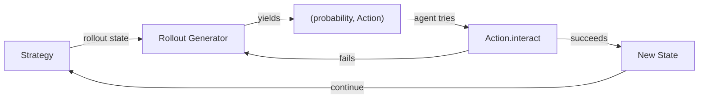
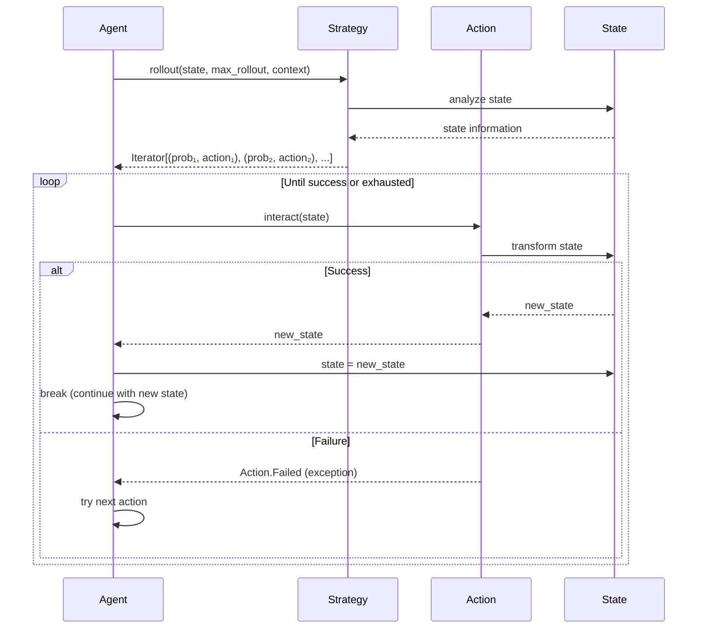

# Search

The search module provides generic search infrastructure for agents working on MDPs.
It is especially focused on MDPs with **infinite action spaces**.

The module contains the following concepts:

## Strategy and Action Abstractions

**Strategy** and **Action** provide a composable framework for agentic systems working with infinite action spaces, particularly suited for tool-calling agents and LLM-based systems.

### Strategy

A **Strategy** proposes ranked action candidates. The [`rollout()`](strategy.py) method lazily generates `(probability, Action)` pairs in **decreasing probability order**, enabling efficient exploration of large or infinite action spaces.

**Key properties:**
- **Lazy generation**: Uses generators to avoid materializing entire action spaces
- **Ranked proposals**: Actions returned in decreasing probability (highest confidence first)
- **Composable**: Strategies can be combined via [`CompositeStrategy`](strategy.py), [`StagedStrategy`](strategy.py), etc.

**Example implementations:**
- [`SafeTacticStrategy`](../rocq/strategies.py): Wraps a single tactic as a strategy
- [`FirstTacticStrategy`](../rocq/strategies.py): Tries multiple tactics in ranked order
- [`OracleStrategy`](../../agent/proof/oracle_agent.py): Proposes actions by looking ahead in the document (useful for data extraction, but not synthesis of new proofs)

### Action

An **Action** represents a single executable operation. The [`interact(state)`](action.py) method transforms state and either returns a new state or raises [`Action.Failed`](action.py) if execution cannot proceed.

**Key properties:**
- **Explicit failure**: Uses exceptions rather than silent failures
- **State transformation**: `interact(state) → new_state`
- **Deduplication**: [`key()`](action.py) provides stable identifiers to describe the action

**Example implementations:**
- [`RocqTacticAction`](../rocq/actions.py): Executes a single Rocq tactic
- [`RocqRetryAction`](../rocq/actions.py): Adds the ability to alter the tactic based on Rocq feedback

### Relationship

The following sequence diagram illustrates a **deterministic, sequential** usage pattern. Agents may also use sampling, parallel exploration, or other strategies (see usage patterns below).

**Usage patterns**: While choosing the highest-probability action is common, Agents have flexibility in how they interpret rollouts; examples include:

- **Deterministic selection**: Iterate through actions in probability order (see [`StrategyAgent.prove()`](../../agent/proof/strategy_agent.py))
- **Sampling with temperature**: Sample from the rollout distribution rather than taking the maximum (see [`Sampled`](search/frontier.py) frontier wrapper)
- **Post-processing**: Filter, prune, or re-rank actions before execution (e.g., based on domain-specific heuristics)
- **Parallel exploration**: Execute multiple actions in parallel via fanout/join operations (see [`RolloutInterleaver`](search/iter.py) and [`Search.continue_search()`](search/search.py))
- **Beam search**: Maintain multiple search paths, expanding the top-k actions from each state (see [`BeamSearch`](search/beam.py))

The generic pattern:
1. Strategy generates ranked actions via `rollout(state, max_rollout, context)`
2. Agent processes the rollout iterator (deterministic, sampled, filtered, etc.)
3. Selected actions are executed via `interact(state)`
4. On success, agent continues with new state; on failure, tries next action
5. Process repeats until goal reached or search exhausted

## Search Dynamics
The [search/](search/) directory contains a [generic search algorithm](search/search.py) that is parametric over the state type which allows it to be used in many contexts.

The search algorithm is parameterized by a [Frontier](search/frontier.py) which allows configuring the search strategy to act with different exploration policies, e.g. BFS, DFS, A*, or Beam searches and also configure other knobs such as sampling rather than deterministic exploration, de-duplication of states, early termination, etc.

### Components

- **`search.py`** - Core search loop with interleaved rollouts
  - `search()` - Generic search function with depth limiting and state deduplication
  - `continue_search()` - Generic search function with depth limiting and state deduplication
  - `StateManip[T]` - Helper for imperative state management

- **`guidance.py`** - Heuristic state scoring
  - `Guidance[T]` - Abstract scoring interface (lower scores = better states)
  - `UniformGuidance[T]` - Default uniform scoring

- **`frontier.py`** - Collection management for search states
  - `Frontier[T, Node]` - Abstract frontier interface
  - `DFS[T]`, `BFS[T]`, `PQueue[T]` - Standard frontiers
  - `SingleDepth[T, Node]` - Beam-style single-depth expansion
  - `SavingSolutions[T, Node]` - Solution tracking
  - `Deduplicate[T, Node]`, `Sampled[T, Node]` - Frontier wrappers

- **`beam.py`** - Beam search using frontier composition
  - `BeamSearch[T]` - Configurable beam search (PQueue → SingleDepth → SavingSolutions)
  - Supports heuristic guidance, depth limiting, state deduplication

## The Rocq Instantiation
The [rocq/](rocq/) directory contains several building blocks that might be useful for connecting these to Rocq.
