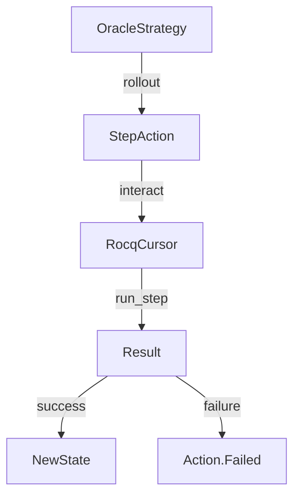

# Rocq Strategies

This connects the Action/Strategy framework to Rocq. It should be de-coupled from the core logic so that the core logic does not depend on anything that is Rocq specific.

## Examples

### Simple Strategy Creating Actions

[`SafeTacticStrategy`](strategies.py) demonstrates a strategy that creates and yields a single action:

```python
class SafeTacticStrategy(Strategy):
    def rollout(self, rdm: RocqCursor, ...) -> Strategy.Rollout:
        return (
            (prob, RocqTacticAction(f"progress ({tac})"))  # Strategy yields Action
            for prob, tac in [(self._prob, self._tactic)]
        )
```

### Action Execution with Failure Handling

[`RocqTacticAction`](actions.py) shows how actions execute and handle failures:

```python
class RocqTacticAction(Action[RocqCursor]):
    def interact(self, state: RocqCursor) -> RocqCursor:
        response = self.run_tactic(state, self._tactic)
        if isinstance(response, RocqCursor.Err):
            raise Action.Failed(message=response.message)  # Explicit failure
        return state  # Success: return new state
```

### Strategy Consuming Actions

[`FirstTacticStrategy`](strategies.py) accepts either strings (converted to actions) or pre-constructed actions, demonstrating flexibility:

```python
class FirstTacticStrategy(Strategy):
    def __init__(self, tactics: list[tuple[float, str | Action]]):
        # Can work with both raw data and pre-made Actions
        self._tactics = [(prob, mk(tac)) for prob, tac in sorted(tactics, reverse=True)]

    def rollout(self, rdm, ...):
        return ((prob, tac) for prob, tac in self._tactics)  # Yields Actions
```

### Complete Example: Oracle Pattern

[`OracleStrategy`](../../agent/proof/oracle_agent.py) and [`StepAction`](../../agent/proof/oracle_agent.py) show a complete strategy-action pair where the strategy creates domain-specific actions:



See [`OracleAgent`](../../agent/proof/oracle_agent.py) for how this strategy is used in practice.
